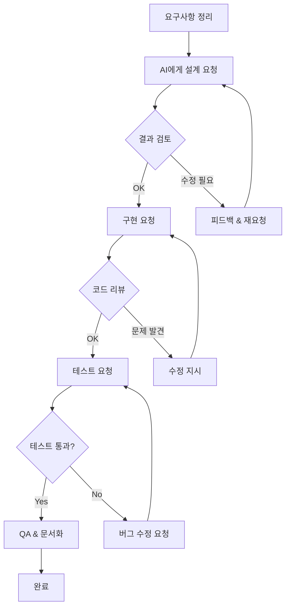

# AI 활용 개발 기록: 구독 가성비 트래커

> 이 문서는 Claude Code를 활용하여 4일 만에 풀스택 웹 애플리케이션을 개발한 경험을 기록합니다.

## 프로젝트 개요

| 항목 | 내용 |
|------|------|
| 프로젝트명 | 구독 가성비 트래커 (Subscription Value Tracker) |
| 개발 기간 | 2026년 1월 8일 ~ 11일 (4일) |
| 총 커밋 | 35개 |
| 사용 AI 도구 | Claude Code (CLI) |
| MCP 연동 | TaskManager, GitHub MCP |
| 기술 스택 | Java 21, Spring Boot 4.x, Thymeleaf, HTMX, Tailwind CSS |

---

## 1. AI 활용 작업 목록

### 1.1 프로젝트 설계 및 문서화

| 작업 | AI 활용 방식 | 결과물 |
|------|-------------|--------|
| PRD 작성 | 아이디어 설명 → 구조화된 PRD 생성 | `PRD.md` |
| 기술 스펙 설계 | 요구사항 기반 데이터 모델, API 설계 | `PROJECT_SPEC.md` |
| 개발 문서 | ERD, 플로우차트 자동 생성 | `DEVELOPMENT.md` |
| 코딩 가이드 | 프로젝트 컨벤션 정의 | `CLAUDE.md` |

### 1.2 백엔드 개발

| 작업 | AI 활용 방식 |
|------|-------------|
| Spring Boot 프로젝트 구조 설계 | DDD 스타일 패키지 구조 제안 |
| Entity 설계 | 요구사항 → JPA Entity + 관계 매핑 |
| Repository/Service 구현 | CRUD + 비즈니스 로직 구현 |
| Controller 구현 | REST API + Thymeleaf 뷰 컨트롤러 |
| 복잡한 계산 로직 | 회당 비용 계산, 손익분기점 계산 |

### 1.3 프론트엔드 개발

| 작업 | AI 활용 방식 |
|------|-------------|
| Thymeleaf 템플릿 | 레이아웃, 컴포넌트 구조화 |
| Tailwind CSS 스타일링 | 다크모드, 반응형 UI |
| HTMX 인터랙션 | 출석 체크 시 부분 업데이트 |
| Chart.js 차트 | 통계 시각화 구현 |
| 캘린더 UI | 월간 달력 + 색상 코딩 |

### 1.4 테스트 코드 작성

| 작업 | AI 활용 방식 |
|------|-------------|
| Service 단위 테스트 | JUnit 5 + Mockito |
| Controller 테스트 | MockMvc 테스트 |
| 유틸리티 테스트 | EmojiMapper, UserIdentifier 테스트 |

### 1.5 버그 수정 및 리팩토링

| 작업 | AI 활용 방식 |
|------|-------------|
| Thymeleaf 보안 이슈 | onclick 핸들러 XSS 취약점 수정 |
| 데이터 직렬화 문제 | HTML data attribute 방식으로 변경 |
| 비용 계산 로직 수정 | 월별 → 전체 기간 기준으로 변경 |

---

## 2. 프롬프트 예시

### 2.1 프로젝트 초기 설정

```
나는 구독 서비스의 가성비를 계산하는 웹앱을 만들고 싶어.
핵심 컨셉은 "출석할수록 금액이 내려가는 걸 눈으로 보면서 뿌듯함 느끼기"야.

기술 스택:
- Java 21 + Spring Boot
- Thymeleaf + HTMX (프론트엔드 빌드 없이)
- H2 (개발) / MySQL (운영)
- Tailwind CSS

PRD를 작성해줘.
```

### 2.2 기능 구현 요청

```
캘린더 뷰를 구현해줘.
- 월간 달력 형태
- 각 날짜에 출석한 구독 서비스의 이모지와 회당 비용 표시
- 색상: 초록(가성비 좋음) / 노랑(보통) / 빨강(경고)
- 날짜 클릭하면 해당 날짜에 출석 체크할 수 있는 모달
```

### 2.3 버그 수정 요청

```
캘린더에서 회당 비용이 이상하게 표시돼.
현재: 이번 달 사용 횟수로 나눔
원하는 것: 구독 시작부터 현재까지 총 사용 횟수로 나눔

예: 12개월 구독 (총 180,000원), 총 10회 사용 → 18,000원/회
```

### 2.4 리팩토링 요청

```
출석 체크할 때 페이지 전체가 새로고침 되는데,
HTMX를 써서 캘린더 영역만 부분 업데이트 되도록 바꿔줘.
```

---

## 3. AI 협업 워크플로우

### 3.1 전체 작업 흐름



### 3.2 단계별 역할 분담

| 단계 | AI 역할 | 내 역할 |
|------|--------|--------|
| **설계** | 구조 제안, 패턴 추천 | 요구사항 명확화, 최종 결정 |
| **구현** | 코드 생성, 보일러플레이트 | 비즈니스 로직 검증, 코드 리뷰 |
| **테스트** | 테스트 코드 작성 | 엣지 케이스 추가, 커버리지 확인 |
| **디버깅** | 원인 분석, 수정안 제시 | 문제 재현, 해결책 선택 |
| **문서화** | 초안 작성 | 맥락 추가, 톤 조정 |

---

## 4. AI 수정 및 디버깅 사례

### 4.1 Thymeleaf 보안 이슈 수정

**문제 상황**
```html
<!-- AI가 처음 생성한 코드 -->
<div th:onclick="'openModal(' + ${date} + ')'">
```

**발생한 오류**
- Thymeleaf에서 보안상 이벤트 핸들러에 동적 변수 사용 불가
- 템플릿 렌더링 시 에러 발생

**수정 지시**
```
onclick에 변수를 직접 넣으면 Thymeleaf 보안 에러가 나.
data attribute에 값을 넣고 JavaScript에서 읽는 방식으로 바꿔줘.
```

**수정된 코드**
```html
<!-- 수정 후 -->
<div class="clickable-date" th:data-date="${date}">

<script>
document.querySelectorAll('.clickable-date').forEach(el => {
    el.addEventListener('click', () => openModal(el.dataset.date));
});
</script>
```

**배운 점**: AI는 기능 구현에 집중하지만, 프레임워크별 보안 제약은 실제 실행해봐야 발견되는 경우가 있음

---

### 4.2 비용 계산 로직 수정

**문제 상황**
```java
// AI가 처음 구현한 로직
public BigDecimal calculateCostPerUse(Long subscriptionId, YearMonth month) {
    int monthlyUsage = getUsageCountForMonth(subscriptionId, month);
    return monthlyAmount.divide(BigDecimal.valueOf(monthlyUsage));
}
```

**문제점 발견**
- 1월에 4번, 2월에 1번 사용 시
- AI 구현: 1월은 ÷4, 2월은 ÷1로 각각 다르게 표시
- 원하는 것: 전체 5번으로 나눠서 모든 날짜에 동일하게 표시

**수정 지시**
```
비용 계산이 이상해. 현재는 월별로 나누는데,
나는 구독 시작부터 현재까지 "총 사용 횟수"로 나누고 싶어.

예시:
- 12개월 구독 총 180,000원
- 총 10회 사용
- 모든 날짜에 18,000원/회로 표시
```

**수정된 코드**
```java
// 수정 후
public BigDecimal calculateCostPerUse(Long subscriptionId) {
    int totalUsage = getTotalUsageCount(subscriptionId);
    BigDecimal totalPaid = calculateTotalPaidAmount(subscriptionId);
    return totalPaid.divide(BigDecimal.valueOf(totalUsage), 0, RoundingMode.HALF_UP);
}
```

**배운 점**: 비즈니스 로직은 구체적인 예시와 함께 설명해야 AI가 정확히 이해함

---

### 4.3 HTMX 부분 업데이트 개선

**문제 상황**
- 출석 체크 버튼 클릭 시 페이지 전체가 새로고침
- 사용자 경험 저하 (깜빡임, 스크롤 위치 초기화)

**개선 요청**
```
출석 체크할 때 페이지 전체가 새로고침 되는데,
HTMX를 써서 해당 카드만 부분 업데이트 되도록 바꿔줘.
요약 통계도 같이 업데이트 되어야 해.
```

**AI 제안 vs 내 선택**

| AI 제안 | 내 판단 |
|--------|--------|
| 카드만 업데이트 (hx-swap) | 요약 통계도 함께 업데이트 필요 |
| 새 엔드포인트 추가 | 기존 엔드포인트에서 HTMX 요청 감지로 처리 |

**최종 구현**
```html
<!-- oob-swap으로 여러 영역 동시 업데이트 -->
<div hx-post="/subscriptions/{id}/check-in"
     hx-target="this"
     hx-swap="outerHTML">

<!-- check-in-response.html -->
<div id="subscription-card-{id}">...</div>
<div id="summary-stats" hx-swap-oob="true">...</div>
```

**배운 점**: AI가 기본 구현을 해주면, UX 관점에서 추가 요구사항을 명확히 전달하는 것이 중요

---

## 5. AI 제안 거절 및 대안 선택 사례

### 5.1 데이터베이스 설계

| AI 제안 | 내 선택 | 이유 |
|--------|--------|------|
| User 테이블 + 로그인 | UUID 쿠키 방식 | MVP 단계에서 복잡도 최소화 |
| UsageLog에 금액 저장 | 금액은 계산으로 도출 | 데이터 정합성, 중복 제거 |

### 5.2 UI/UX 결정

| AI 제안 | 내 선택 | 이유 |
|--------|--------|------|
| 모달로 구독 등록 | 별도 페이지 | 입력 필드가 많아 모달은 불편 |
| 무한 스크롤 | 월별 페이지네이션 | 캘린더 특성상 월 단위가 자연스러움 |

### 5.3 기술 선택

| AI 제안 | 내 선택 | 이유 |
|--------|--------|------|
| React 프론트엔드 | Thymeleaf + HTMX | 빌드 없이 빠른 개발, 학습 목적 |
| JPA 양방향 관계 | 단방향 관계 | 순환 참조 방지, 단순성 |

---

## 6. AI 활용의 장점

### 6.1 생산성 향상

| 항목 | AI 없이 (추정) | AI 활용 | 단축률 |
|------|---------------|---------|--------|
| PRD/스펙 문서 | 2-3일 | 2-3시간 | ~90% |
| Entity + Repository | 4-6시간 | 30분 | ~90% |
| CRUD API + 화면 | 2-3일 | 4-6시간 | ~70% |
| 캘린더 UI | 1-2일 | 2-3시간 | ~80% |
| 차트 기능 | 4-6시간 | 1-2시간 | ~70% |
| **전체 프로젝트** | **3-4주** | **4일** | **~85%** |

### 6.2 코드 품질

- **일관된 코드 스타일**: 프로젝트 전반에 동일한 패턴 적용
- **모범 사례 적용**: Spring Boot, JPA 베스트 프랙티스 자동 적용
- **보안 이슈 감지**: XSS 취약점 등 보안 문제 발견 및 수정
- **테스트 코드 작성**: 단위 테스트 자동 생성

### 6.3 학습 효과

- 새로운 기술(HTMX) 빠르게 적용
- Tailwind CSS 클래스 활용법 습득
- Spring Boot 4.x 새 기능 학습

---

## 7. AI 활용의 한계 및 주의점

### 7.1 맥락 이해의 한계

> 섹션 4에서 상세 사례를 다뤘으므로, 여기서는 요약만 제시

- 비즈니스 요구사항이 모호하면 AI도 잘못 구현함
- **해결책**: 구체적인 예시와 함께 요구사항 설명

### 7.2 UI/UX 감각

- AI는 기능 구현에 강하지만, 미적 감각은 제한적
- 색상 선택, 레이아웃 배치 등은 직접 조정 필요
- 와이어프레임 등 시각적 레퍼런스 제공하면 효과적

### 7.3 비즈니스 로직 검증 필요

```java
// AI가 생성한 코드
public BigDecimal calculateCostPerUse() {
    if (totalUsageCount == 0) return totalAmount; // 0으로 나누기 방지
    return totalAmount.divide(BigDecimal.valueOf(totalUsageCount),
                              0, RoundingMode.HALF_UP);
}

// 검토 포인트
// - 0회 사용 시 전체 금액 반환이 맞는지?
// - 반올림 방식이 적절한지?
```

### 7.4 지속적인 커뮤니케이션

- 한 번에 완벽한 코드를 기대하지 말 것
- 반복적인 피드백과 수정 요청 필요
- 작은 단위로 요청하고 검증하는 것이 효과적

---

## 8. 효과적인 AI 활용 팁

### 8.1 명확한 컨텍스트 제공

```
좋은 예:
"Spring Boot 4.x + Thymeleaf + HTMX 환경에서
출석 체크 버튼 클릭 시 캘린더 영역만 부분 업데이트"

나쁜 예:
"출석 체크 기능 만들어줘"
```

### 8.2 CLAUDE.md 활용

프로젝트 루트에 `CLAUDE.md` 파일을 두면 Claude Code가 자동으로 읽어서 컨텍스트로 활용합니다:

```markdown
# CLAUDE.md
- 기술 스택 정보
- 프로젝트 구조
- 코딩 컨벤션
- 테스트 규칙
- Git 워크플로우
```

### 8.3 단계별 개발

```
1단계: 엔티티 설계 → 검토 → 확정
2단계: Repository + Service → 검토 → 확정
3단계: Controller + View → 검토 → 확정
4단계: 테스트 코드 → 검토 → 확정
```

### 8.4 QA 프로세스

기능 개발 후 AI에게 QA 테스트 항목을 요청:

```
개발 완료 후 확인해야 할 QA 항목을 정리해줘.
```

결과를 `QA_RESULTS.md`에 기록하여 품질 관리.

### 8.5 MCP (Model Context Protocol) 활용

Claude Code는 MCP를 통해 외부 도구와 연동할 수 있습니다. 이 프로젝트에서 활용한 MCP 도구:

| MCP 도구 | 용도 |
|----------|------|
| **TaskManager** | 복잡한 작업을 하위 태스크로 분해하여 관리. 진행 상황 추적 및 체크리스트 관리에 활용 |
| **GitHub MCP** | PR 생성, 이슈 관리, 커밋 히스토리 조회 등 GitHub 작업을 Claude Code 내에서 직접 수행 |

MCP 설정 방법:
```bash
# Claude Code 설정에서 MCP 서버 추가
claude mcp add taskmanager
claude mcp add github
```

---

## 9. AI 없이 직접 수행한 역할 (TODO)

> 이 섹션은 프로젝트 고도화 후 작성 예정

### 9.1 아키텍처 및 설계 결정

| 결정 사항 | 선택지 | 최종 결정 | 이유 |
|-----------|--------|-----------|------|
| (예시) 데이터베이스 | MySQL vs PostgreSQL | - | - |
| - | - | - | - |

### 9.2 요구사항 분석 및 정의

- 비즈니스 요구사항을 기술 요구사항으로 변환한 사례
- AI에게 설명하기 위해 직접 정리한 내용

### 9.3 코드 리뷰 및 품질 검증

- AI 생성 코드에서 발견한 문제점
- 직접 수정하거나 개선한 부분

---

## 10. 기술적 깊이: 복잡한 문제 해결 (TODO)

> 이 섹션은 프로젝트 고도화 후 작성 예정

### 10.1 성능 최적화

| 문제 | 원인 분석 | 해결 방법 | 결과 |
|------|----------|----------|------|
| (예시) N+1 쿼리 | - | - | - |

### 10.2 동시성/트랜잭션 이슈

- 발생한 문제
- 해결 과정

### 10.3 보안 고려사항

- 적용한 보안 조치
- 취약점 발견 및 대응

---

## 11. 운영 경험 (TODO)

> 이 섹션은 실제 운영 후 작성 예정

### 11.1 배포 및 인프라

| 항목 | 내용 |
|------|------|
| 배포 환경 | (예: AWS EC2, Docker 등) |
| CI/CD | - |
| 모니터링 | - |

### 11.2 장애 대응

| 날짜 | 증상 | 원인 | 해결 | 재발 방지 |
|------|------|------|------|----------|
| - | - | - | - | - |

### 11.3 사용자 피드백 반영

| 피드백 | 개선 내용 |
|--------|----------|
| - | - |

---

## 12. 결론

### 12.1 AI 활용 개발의 핵심

1. **AI는 도구**: 최종 결정과 검증은 개발자의 몫
2. **명확한 요구사항**: 구체적인 예시와 컨텍스트 제공
3. **반복적 개선**: 한 번에 완벽한 코드를 기대하지 말 것
4. **문서화**: CLAUDE.md 등으로 프로젝트 컨텍스트 유지

### 12.2 이 프로젝트에서 배운 점

- 4일 만에 풀스택 웹앱 MVP 완성 가능
- AI와의 협업은 "페어 프로그래밍"에 가까움
- 코드 리뷰와 테스트의 중요성은 여전함
- 비즈니스 로직 이해와 검증은 개발자의 역할

---

## 13. 향후 계획: Ralph Wiggum 자율 루프 활용

### 13.1 Ralph Wiggum이란?

[Ralph Wiggum](https://github.com/anthropics/claude-code/tree/main/plugins/ralph-wiggum)은 Claude Code의 공식 플러그인으로, AI가 **자율적으로 반복 작업**을 수행하게 하는 기법입니다.

```
작업 시작 → Claude 작업 → 종료 시도 → Stop hook이 차단 → 같은 프롬프트 재주입 → 반복
```

심슨의 캐릭터 이름에서 유래했으며, 2025년 말 Anthropic이 공식 채택했습니다.

### 13.2 적용 예정 작업

| 작업 | 목표 | 예상 iteration |
|------|------|----------------|
| 테스트 커버리지 확대 | 80% 이상 달성 | 10-20 |
| 코드 리팩토링 | 중복 코드 제거, 패턴 통일 | 10-15 |
| 성능 최적화 | N+1 쿼리 해결, 캐싱 적용 | 5-10 |
| 새 기능 추가 | (추후 결정) | TBD |

### 13.3 사용 계획

```bash
# 플러그인 설치
claude plugins install ralph-wiggum

# 테스트 커버리지 확대 예시
/ralph-loop "테스트 커버리지를 80% 이상으로 올려줘.
현재 테스트가 없는 Service, Controller를 찾아서
JUnit 5 + Mockito로 테스트 작성해줘." \
--completion-promise "COVERAGE_COMPLETE" \
--max-iterations 20
```

### 13.4 비용 및 리스크 관리

| 항목 | 전략 |
|------|------|
| 토큰 비용 | `--max-iterations` 제한 (초기 10-20) |
| 품질 검증 | 매 iteration 후 diff 리뷰 |
| 롤백 계획 | 작업 전 브랜치 생성, 실패 시 reset |

### 13.5 결과 기록 (예정)

> 이 섹션은 Ralph Wiggum 활용 후 실제 결과로 업데이트 예정

| 날짜 | 작업 | Iterations | 소요 시간 | 비용 | 결과 |
|------|------|------------|----------|------|------|
| - | - | - | - | - | - |

**기대 효과:**
- 반복적인 작업의 자동화
- 개발자는 검증과 의사결정에 집중
- AI 자율 에이전트 운영 경험 축적

---

## 부록: 프로젝트 통계

```
개발 기간: 4일 (2026-01-08 ~ 2026-01-11)
총 커밋: 35개
코드 라인: ~3,000+ (추정)

파일 구성:
- Java 소스: ~20개
- Thymeleaf 템플릿: ~15개
- 테스트 코드: ~10개
- 문서: 7개 (.md 파일)
```

---

*이 문서는 Claude Code를 활용하여 작성되었습니다.*
