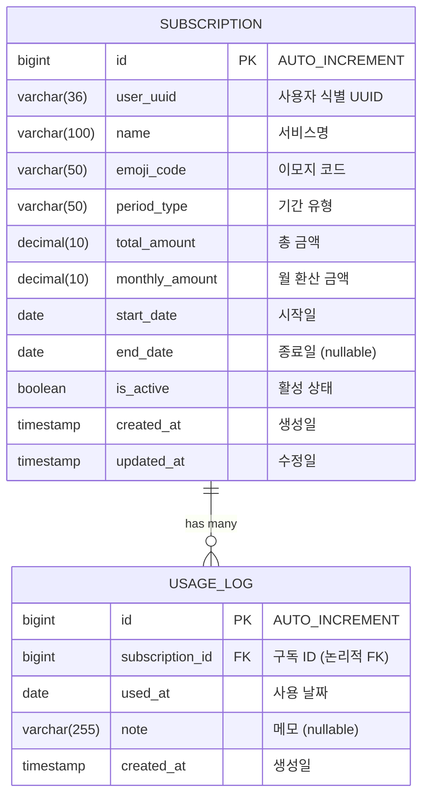
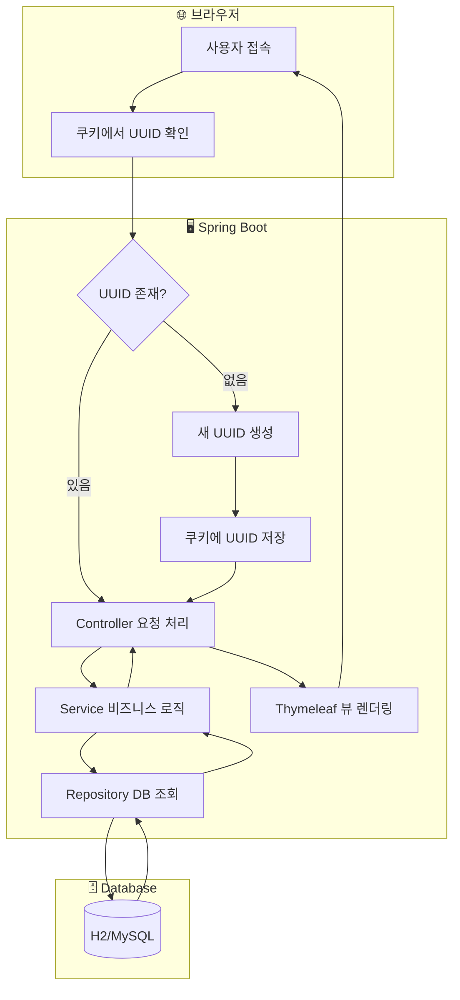
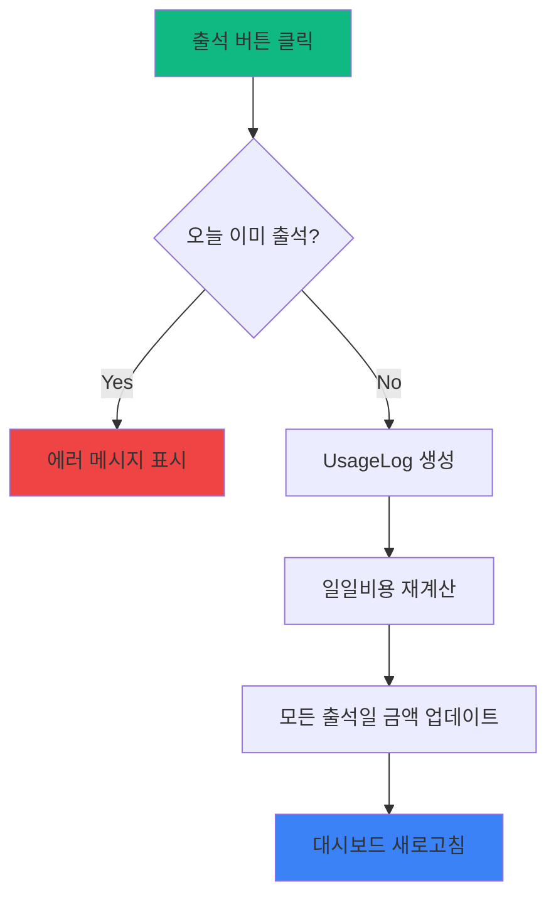
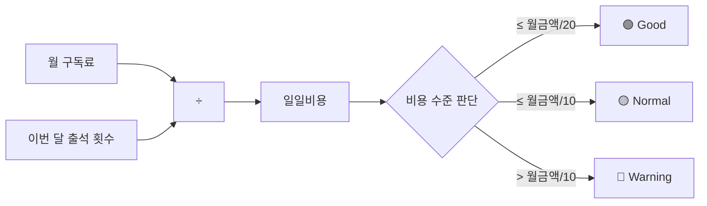
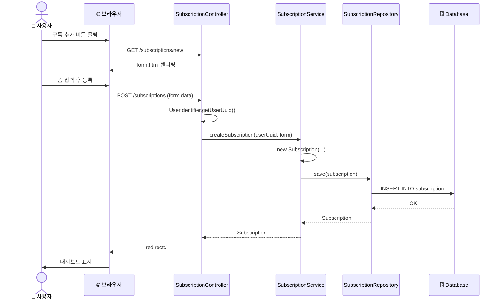
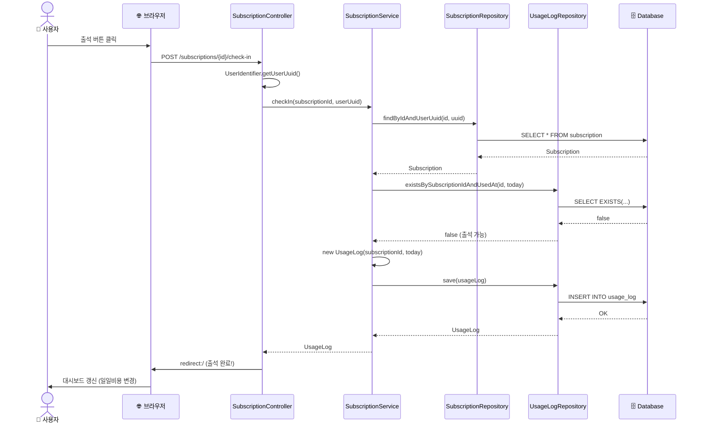
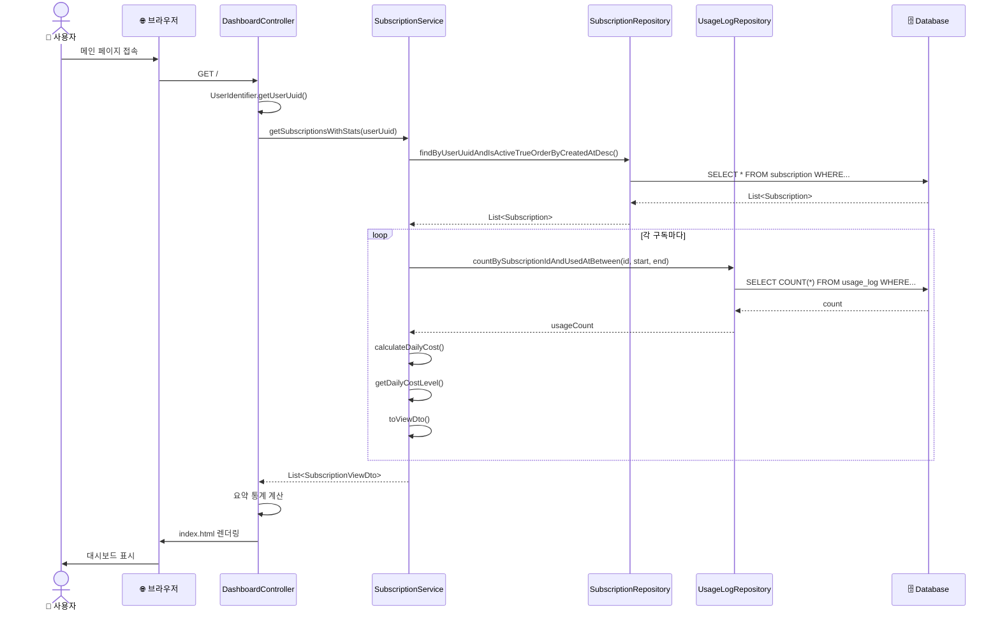

# 개발 문서 (Development Documentation)

## 1. 패키지 구조

```
src/main/java/com/tracker/subscriptionvaluetracker/
│
├── SubscriptionValueTrackerApplication.java    # Spring Boot 메인 클래스
│
├── common/                                      # 공통 유틸리티
│   ├── UserIdentifier.java                     # UUID 쿠키 기반 사용자 식별
│   └── EmojiMapper.java                        # 이모지 코드 ↔ 이모지 변환
│
├── domain/                                      # 도메인 레이어 (DDD 스타일)
│   └── subscription/                           # 구독 도메인
│       ├── Subscription.java                   # 구독 엔티티
│       ├── UsageLog.java                       # 출석/사용 기록 엔티티
│       ├── SubscriptionRepository.java         # 구독 JPA Repository
│       ├── UsageLogRepository.java             # 출석 JPA Repository
│       ├── SubscriptionService.java            # 구독 비즈니스 로직
│       ├── CalendarService.java                # 캘린더 비즈니스 로직
│       ├── SubscriptionController.java         # 구독 CRUD 컨트롤러
│       ├── SubscriptionForm.java               # 입력 폼 DTO
│       ├── SubscriptionViewDto.java            # 뷰 출력 DTO
│       └── CalendarDayDto.java                 # 캘린더 일자 DTO
│
└── web/                                         # 웹 레이어
    ├── DashboardController.java                # 메인 대시보드 컨트롤러
    └── CalendarController.java                 # 캘린더 컨트롤러
```

### 레이어 설명

| 레이어 | 역할 | 파일 |
|--------|------|------|
| **Controller** | HTTP 요청 처리, 뷰 렌더링 | `*Controller.java` |
| **Service** | 비즈니스 로직, 트랜잭션 관리 | `*Service.java` |
| **Repository** | 데이터 접근 (JPA) | `*Repository.java` |
| **Entity** | 데이터베이스 테이블 매핑 | `Subscription.java`, `UsageLog.java` |
| **DTO** | 데이터 전송 객체 | `*Form.java`, `*ViewDto.java` |

---

## 2. ERD (Entity Relationship Diagram)



### 테이블 관계

- **SUBSCRIPTION : USAGE_LOG = 1 : N**
  - 하나의 구독에 여러 출석 기록이 있음
  - FK는 논리적으로만 관리 (물리적 제약 없음)
  - `user_uuid`로 사용자별 데이터 격리

### 인덱스

```sql
-- 사용자별 구독 조회 최적화
CREATE INDEX idx_subscription_user ON subscription(user_uuid);

-- 구독별 월간 사용량 조회 최적화
CREATE INDEX idx_usage_subscription_date ON usage_log(subscription_id, used_at);

-- 날짜별 사용 기록 조회
CREATE INDEX idx_usage_used_at ON usage_log(used_at);
```

---

## 3. 데이터 흐름 (Flowchart)

### 3.1 전체 시스템 흐름



### 3.2 출석 체크 흐름



### 3.3 일일비용 계산 로직



---

## 4. 시퀀스 다이어그램 (Sequence Diagram)

### 4.1 구독 등록



### 4.2 출석 체크



### 4.3 대시보드 조회



---

## 5. 핵심 비즈니스 로직

### 5.1 일일비용 계산

```java
// SubscriptionService.java
public BigDecimal calculateDailyCost(Subscription subscription) {
    int usageCount = getMonthlyUsageCount(subscription.getId());
    if (usageCount == 0) {
        return subscription.getMonthlyAmount(); // 사용 안하면 월 전체 금액
    }
    return subscription.getMonthlyAmount()
            .divide(BigDecimal.valueOf(usageCount), 0, RoundingMode.HALF_UP);
}
```

### 5.2 비용 수준 판단

```java
// 일일 비용 색상 결정
public String getDailyCostLevel(BigDecimal dailyCost, BigDecimal monthlyAmount) {
    BigDecimal goodThreshold = monthlyAmount.divide(BigDecimal.valueOf(20));   // 5%
    BigDecimal normalThreshold = monthlyAmount.divide(BigDecimal.valueOf(10)); // 10%

    if (dailyCost.compareTo(goodThreshold) <= 0) return "good";      // 🟢
    if (dailyCost.compareTo(normalThreshold) <= 0) return "normal";  // 🟡
    return "warning";                                                 // 🔴
}
```

### 5.3 사용자 식별

```java
// UserIdentifier.java
public static String getUserUuid(HttpServletRequest request, HttpServletResponse response) {
    // 1. 쿠키에서 UUID 찾기
    Cookie[] cookies = request.getCookies();
    if (cookies != null) {
        for (Cookie cookie : cookies) {
            if ("user_uuid".equals(cookie.getName())) {
                return cookie.getValue();
            }
        }
    }

    // 2. 없으면 새로 생성하고 쿠키에 저장 (30일)
    String uuid = UUID.randomUUID().toString();
    Cookie newCookie = new Cookie("user_uuid", uuid);
    newCookie.setMaxAge(60 * 60 * 24 * 30);
    newCookie.setPath("/");
    newCookie.setHttpOnly(true);
    response.addCookie(newCookie);
    return uuid;
}
```

---

## 6. 템플릿 구조

```
src/main/resources/templates/
│
├── layout/
│   └── default.html          # 공통 레이아웃 (헤더, 푸터, Tailwind, HTMX)
│
├── index.html                # 대시보드 (요약 카드 + 구독 목록)
│
├── subscription/
│   ├── list.html            # 구독 목록 페이지
│   └── form.html            # 구독 등록/수정 폼
│
├── investment/              # (예정) 투자형 항목
│   ├── list.html
│   └── form.html
│
└── fragments/               # (예정) 재사용 컴포넌트
    ├── card.html
    └── calendar.html
```

---

## 7. API 엔드포인트

| Method | Endpoint | 설명 | Controller |
|--------|----------|------|------------|
| GET | `/` | 대시보드 | DashboardController |
| GET | `/calendar` | 캘린더 뷰 | CalendarController |
| GET | `/calendar/grid` | 캘린더 그리드 (HTMX) | CalendarController |
| GET | `/subscriptions` | 구독 목록 | SubscriptionController |
| GET | `/subscriptions/new` | 구독 등록 폼 | SubscriptionController |
| POST | `/subscriptions` | 구독 등록 | SubscriptionController |
| GET | `/subscriptions/{id}/edit` | 구독 수정 폼 | SubscriptionController |
| POST | `/subscriptions/{id}` | 구독 수정 | SubscriptionController |
| POST | `/subscriptions/{id}/delete` | 구독 삭제 (soft delete) | SubscriptionController |
| POST | `/subscriptions/{id}/check-in` | 출석 체크 | SubscriptionController |

---

## 8. 테스트 코드 구조

### 테스트 디렉토리
```
src/test/java/com/tracker/subscriptionvaluetracker/
├── SubscriptionValueTrackerApplicationTests.java  # 통합 테스트
│
├── domain/subscription/
│   ├── SubscriptionServiceTest.java     # 서비스 단위 테스트 (25+ 테스트)
│   ├── SubscriptionControllerTest.java  # 컨트롤러 단위 테스트 (10+ 테스트)
│   └── CalendarServiceTest.java         # 캘린더 서비스 테스트 (5+ 테스트)
│
├── common/
│   ├── EmojiMapperTest.java             # 이모지 변환 테스트
│   └── UserIdentifierTest.java          # 사용자 식별 테스트
│
└── web/
    └── CalendarControllerTest.java      # 캘린더 컨트롤러 테스트 (8+ 테스트)
```

### 테스트 실행
```bash
# 전체 테스트 실행
./gradlew test

# 특정 클래스만 실행
./gradlew test --tests "SubscriptionServiceTest"

# 테스트 리포트 확인
open build/reports/tests/test/index.html
```

### 테스트 커버리지

| 클래스 | 테스트 항목 |
|--------|-------------|
| SubscriptionService | 구독 CRUD, 출석 체크/토글, 일일비용 계산, 비용 레벨 판단 |
| SubscriptionController | 목록 조회, 폼 표시, 생성/수정/삭제, 출석 체크 |
| CalendarService | 캘린더 데이터 생성, 출석 기록 표시, 범례 조회 |
| CalendarController | 캘린더 페이지, 그리드 HTMX, 월 이동, 통계 계산 |
| EmojiMapper | 코드→이모지 변환, 기본값 처리, 전체 코드 조회 |
| UserIdentifier | UUID 쿠키 생성/조회, 쿠키 설정 검증 |

---

## 9. 향후 개발 예정

### ~~Phase 2: 캘린더 뷰~~ ✅ 완료
- ~~월간 달력에 출석 기록 표시~~
- ~~이모지 + 일일비용 표시~~
- ~~HTMX로 월 이동~~

### ~~Phase 2.5: 출석 기능 개선~~ ✅ 완료
- ~~출석 토글 (클릭하면 취소)~~
- ~~캘린더 날짜 클릭 시 출석 체크~~
- ~~구독 선택 모달~~

### Phase 3: 투자형 항목
- Investment 엔티티
- 손익분기점 계산
- 절약액 추적

### Phase 4: 차트
- Chart.js 월별 사용 추이
- 구독별 비용 비교
